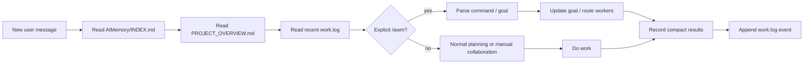
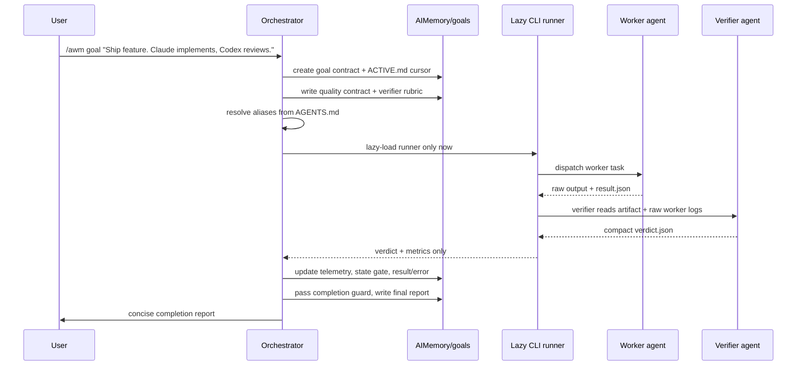

# AgentWorkMux

[Korean README](README.ko.md)

> Markdown memory and work routing for AI coding agents.

[](LICENSE)
[]()
[]()

AgentWorkMux lets Claude Code, ChatGPT Codex CLI, OpenCode, Aider, Continue,
gemini-cli, and other headless-capable file agents share project memory, route
work, run explicit goals, and resume across sessions.

Headless worker support is intentionally narrower than markdown compatibility.
Editor launchers that only open windows or chats, such as Cursor and
Antigravity in current probes, are classified as `gui_only` until they return a
machine-readable stdout stream or result file.

It is markdown-first. The durable state lives in `AIMemory/`; the main command
surface is `/awm`.

---

## Quick Start

### Install

Open any agent in your project directory and say:

```text
Fetch https://raw.githubusercontent.com/daystar7777/agent-work-mux/main/prompt.md and apply it to this project.
```

Or:

```text
Install daystar7777/agent-work-mux into this project.
```

The agent creates `AIMemory/` and installs the AgentWorkMux protocol.

### Run A Goal

For goal-level orchestration, use `/awm goal`:

```text
/awm goal "Ship the auth hardening slice. Claude implements, Codex reviews, and the current agent writes the final report."
```

`/awm goal` accepts natural language as a goal request. Quotes are optional
unless the request starts with a reserved goal subcommand such as `list` or
`status`. It creates a goal record, resolves project agent aliases, defaults to
auto-run after parsing/planning, and stores compact results/errors under
`AIMemory/goals/`.

New goal orchestration requires an explicit goal command form: `/awm goal
<request>` or `/awm goals <request>`. Other AWM commands can be invoked with
either `/awm ...` or clear natural language, such as asking to set up
AgentWorkMux, list agents, register a worker, test agents, show hints,
uninstall, run a named non-goal task, or create a manual handoff.

### Resume Later

In a new session, say:

```text
Read the project structure and AIMemory, then tell me you understand the current state.
```

The agent reads `AIMemory/INDEX.md`, `AIMemory/PROJECT_OVERVIEW.md`, and recent
`work.log` state before acting.

---

## Language Policy

Operational prompt surfaces are English-only: `prompt.md`, `PROTOCOL.md`,
`upgrade.md`, `uninstall.md`, `migration.md`, `runner.md`, and generated
protocol templates.

Localized README files are human documentation only. User-provided text in
logs, goals, and handoffs is preserved verbatim.

---

## What This Solves

AgentWorkMux helps when:

- an agent forgets after `/compact`, a model swap, or a reboot
- several agents need the same project state without copy-paste summaries
- you want one agent to orchestrate a goal while other workers implement or test
- you need an audit trail of prompts, actions, files changed, tests, and results
- old context should stay searchable without bloating every new session
- you want uninstall/reinstall to preserve project memory

The core is still just markdown. The optional CLI runner is lazy-loaded only for
explicit `/awm` commands.

Executable runner helpers are not canonical repo source. Their source lives in
tracked `*.js.md` helper specs that contain generation notes, OS/runtime
differences, validation rules, and extractable OS-specific code blocks. The
generated helper should use the OS default shell first: PowerShell plus an
optional `.cmd` shim on Windows, POSIX `sh` on Unix-like systems, and `bash`,
Node, or .NET only as an explicit fallback selected by setup/probe.
Setup/probe/first runner use lazily materializes them into ignored
`.agent-work-mux/bin/` files for the current OS/runtime.

---

## Core Files

```text
your-project/
  AIMemory/
    INDEX.md              file inventory and topic index
    PROJECT_OVERVIEW.md   onboarding primer for new sessions
    PROTOCOL.md           installed AgentWorkMux rules
    INSTALLATION.md       install/reinstall/uninstall metadata
    AGENTS.md             project-scoped aliases and routing policy
    work.log              append-only hot event log
    goals/                /awm goal cursor, records, and compact results
      ACTIVE.md           current goal pointer and resume cursor
      INDEX.md            goal history ledger and status dashboard
    archive/              warm rotated logs
    cold/                 long-period digests
    handoff_*.md          manual AICP messages
```

Private runner state is ignored by git:

```text
.agent-work-mux/
  agents.local.md
  bin/
  helpers/
  probes/
  runs/<goal-id>/
  tmp/
```

`AIMemory/`, `.codex/`, `.claude/`, `.opencode/`, `.agent-work-mux/`, and the
legacy `.agent-work-mem/` directory should not be committed.

---

## How AgentWorkMux Works

Normal session flow:



Goal orchestration flow:



Manual AICP handoff files still exist, but they are now the fallback/lower-level
message protocol. The primary user-facing workflow is `/awm goal`.

---

## `/awm` Commands

```text
/awm setup
/awm agents
/awm agents list
/awm agents add <description> [--as <alias>] [--selector <agent[:model-or-tier[:profile]]>]
/awm agent add <alias> <selector-or-description>
/awm agents test [--all | <agent-selector>] [--smoke] [--live]
/awm agents hints [agent-selector]
/awm goal <goal request> [--policy <policy>] [--with <agents>]
/awm goals [<goal request>] [--policy <policy>] [--with <agents>]
/awm goal list [--state <state>] [--limit <n>]
/awm goal history [goal-id] [--limit <n>]
/awm goal status [goal-id]
/awm goal pause <goal-id>
/awm goal resume <goal-id>
/awm goal stop <goal-id>
/awm goal clear [--completed | --stopped | --all]
/awm run <task> [agent-selector]
/awm handoff <target-agent> <task>
/awm uninstall
```

Important rules:

- `list`, `history`, `status`, `pause`, `resume`, `stop`, and `clear` are
  reserved `/awm goal` subcommands.
- New goal requests may be unquoted when the first word is not reserved:
  `/awm goal Ship the auth slice`. Use quotes when the request starts with a
  reserved word: `/awm goal "list flaky tests and fix them"`.
- Quotes are also the safest form when the request text itself contains
  option-like tokens such as `--policy`.
- `/awm goal` defaults to auto-run after parsing/planning.
- `/awm setup` refreshes lifecycle metadata, aliases, and runner pointers; it
  does not dispatch workers.
- `/awm agents` and `/awm agents list` show registered aliases and call hints
  without testing or dispatching workers. Natural language such as "show the
  registered agents" maps here.
- `/awm agents add OpenCode DeepSeek` registers a safe project alias such as
  `opencode-deepseek -> opencode:deepseek:auto` in `AIMemory/AGENTS.md`; it
  does not test or dispatch the worker.
- `/awm agent add deepseek OpenCode:DeepSeek` and
  `/awm agent add deepseek OpenCode DeepSeek` register the explicit alias
  `deepseek -> opencode:deepseek:auto`.
- Natural language can trigger non-goal AWM commands when the intent is clear,
  but it must not create a new goal. Ask the user to use `/awm goal ...` or
  `/awm goals ...` for goal-level orchestration.
- Goal records store state, compact results, and errors, not full transcripts.
- `AIMemory/goals/ACTIVE.md` points to the current goal and resume checkpoint.
- `AIMemory/goals/INDEX.md` lists current and previous goals, status, dates,
  quality score, worker/orchestrator token and cost telemetry when available,
  and final report links.
- The orchestrator updates lightweight telemetry so long-running work can
  resume without loading raw worker transcripts.
- The orchestrator writes one integrated final report when the goal completes.

Goal states:

```text
active
awaiting_user
paused
error_paused
stopped
complete
```

Legacy aliases:

```text
/awm goals            -> /awm goal list
/awm goals <request>  -> /awm goal <request>
/awm status --all     -> /awm goal list
/awm status <goal-id> -> /awm goal status <goal-id>
/awm pause <goal-id>  -> /awm goal pause <goal-id>
/awm resume <goal-id> -> /awm goal resume <goal-id>
```

---

## Goal Mechanics

`/awm goal` borrows the useful shape of Codex-style goal tracking, but keeps the
state in markdown so any agent can resume it.

- **Active goal cursor**: `AIMemory/goals/ACTIVE.md` names the current goal,
  state, last completed task, next checkpoint, and final-report status.
- **Goal history ledger**: `AIMemory/goals/INDEX.md` is lazy-read for
  `/awm goal list`, `/awm status --all`, or user questions about previous goals.
  It shows objective, state, created/updated/completed times, orchestrator,
  quality score, worker/orchestrator token and cost telemetry, final report
  path, and goal record path.
- **Goal contract**: each `AIMemory/goals/<goal-id>.md` stores objective,
  parsed tasks, worker assignments, policy, results, errors, telemetry, and
  completion guard status.
- **State gate**: runner dispatch is allowed only while state is `active`.
  `awaiting_user`, `paused`, and `error_paused` stop auto-run immediately.
- **Budget/telemetry loop**: compact counters and checkpoints are updated after
  each worker result; raw logs stay in `.agent-work-mux/runs/`.
- **Quality contract**: implementation goals should include explicit quality
  gates before dispatch, so workers optimize for good code instead of only
  passing the visible spec.
- **Integration contract**: the orchestrator defines component boundaries,
  public data/API contracts, assembly rules, and end-to-end acceptance so the
  parts add up to the requested whole.
- **Dispatch preview**: before the first worker launch, the orchestrator shows a
  compact plan with the objective, output root, design summary, phases,
  phase-by-phase worker/verifier assignments, capsule paths, timeout policy,
  quality gates, and controller/verifier role boundary. Auto-run continues by
  default unless the user interrupts or the plan is ambiguous.
- **Verifier-owned logs**: when a verifier/tester task exists, that verifier
  reads worker logs and writes a compact `verdict.json`; the orchestrator waits
  for that verdict instead of tailing raw worker stdout.
- **Controller trust discipline**: after dispatch, the orchestrator trusts the
  worker/verifier binding and avoids repeated source inspection, test reruns,
  or progress-log reads unless a timeout, missing capsule, failed exit, or
  explicit debug request appears.
- **Controller role boundary**: when a verifier/tester is assigned, backend
  tests, frontend tests, smoke tests, live server/API/browser probes, quality
  review, and raw-log summarization belong to that verifier/tester. The
  orchestrator focuses on design, dispatch, capsule validation, final decision,
  and final report.
- **Implementer boundary**: when a verifier/tester is assigned, implementers
  create the app, scripts, and artifacts, but do not run acceptance phases or
  direct long-running commands such as `npm start`. Live service checks and
  process cleanup stay with the verifier/tester.
- **Completion guard**: a goal cannot become `complete` until every task is
  resolved, errors are either fixed or documented, tests/verification are
  recorded, and the final report is written.

This makes goal work resumable after context loss without turning the active
orchestrator into a transcript sink.

`/awm goal list` reads the ledger and prints a compact dashboard. If a final
report exists, it should show the report path. If token usage is unavailable
from a worker, record `unknown`; if it is estimated, mark it as `estimated`.

`/awm goal stop <goal-id>` is a terminal user stop, distinct from `paused`.
`/awm goal clear` only clears the active cursor or folds ledger rows by default;
it must not delete goal records unless the user gives an explicit destructive
confirmation.

---

## Agent Selectors And Aliases

Agent references use:

```text
<agent>[:<model-or-tier>[:<profile>]]
```

Examples:

```text
claude
claude:opus-4.7:max
gemini:pro
codex:gpt-5-codex
deepseek:coder:local
```

If only an agent name is provided, the orchestrator chooses a model/profile by
task difficulty and records the choice in the goal record.

Aliases are project-scoped and live in `AIMemory/AGENTS.md`, for example:

```text
claude-max -> claude:opus-4.7:max
deepseek-pro-max -> deepseek:coder:max
opencode-deepseek -> opencode:deepseek:auto
deepseek-local -> opencode:deepseek:auto
```

Use `/awm agents add <description>` to register a new alias. The command accepts
natural-language descriptions and common local-language names; for example,
`/awm agents add OpenCode DeepSeek` creates `opencode-deepseek` unless you override
it with `--as` or `--selector`. Use
`/awm agent add <alias> <selector-or-description>` when you want to choose the
alias directly; both `/awm agent add deepseek OpenCode:DeepSeek` and
`/awm agent add deepseek OpenCode DeepSeek` register
`deepseek -> opencode:deepseek:auto`. New aliases are marked untested until
`/awm agents test <alias> --smoke` passes.

Keep secrets, credentials, auth tokens, private executable paths, and local
account names out of `AIMemory/AGENTS.md`. Put private overrides under ignored
`.agent-work-mux/` files or environment variables.

---

## Agent Call Probes

After installation, run a small probe before relying on headless workers:

```text
/awm agents test --all --smoke
```

This lazy-loads `agent-call-probe.md`, probes each configured worker, records
raw logs under ignored `.agent-work-mux/probes/`, and writes compact hints to
`AIMemory/AGENTS.md`. Guarded CLIs are check-only by default: Codex CLI,
Claude CLI, and Gemini CLI verify version and non-prompt auth state where
available without sending a live prompt unless the user explicitly requests
actual execution or passes `--live`. This prevents recursive same-family calls
such as Codex invoking Codex CLI, Claude invoking Claude CLI, or
Antigravity/Gemini invoking Gemini CLI by default.

Hints capture the working invocation, CLI version, headless status, telemetry
shape, known warnings, and corrected commands after failures. Re-run the probe
when an agent version changes. Use `/awm agents hints` to read the current
hints without calling any agent.

Current default worker smoke shapes include `opencode run --format json`,
`aider --message ... --no-git --no-auto-commits` with history files redirected
under `.agent-work-mux/tmp/`, and Continue's `cn --readonly -p ... --format
json`. Guarded live shapes include `codex exec --json`, `gemini --prompt ...
--approval-mode plan --output-format json`, and `claude -p ... --output-format
json`; use them only after an explicit user request or `--live`.

Continue is supported through its `cn` CLI, not just the IDE. `cn -p "<prompt>"`
runs a headless one-shot, `--format json` provides machine-readable output, and
`cn serve --port <port>` exposes an HTTP server surface with `/state` and
`/message`. `--readonly` gives a plan/read-only mode. Use `--allow`, `--ask`,
or `--exclude` for per-tool permission gates before enabling edits. For
DeepSeek, any Continue-supported secret setup is fine as long as it populates
the model `apiKey`. If local env fallback produces a DeepSeek 401 with
`Bearer sk-` wording, use an explicit secret reference such as
`apiKey: ${{ secrets.//DEEPSEEK_API_KEY }}` in that local config.

Claude Code uses `claude -p "<prompt>" --output-format json --permission-mode
plan` for explicit live headless probes. By default, only check `claude
--version` and auth state. If a user-approved live run is blocked by account
billing, quota, or a probe budget cap, classify the result as `billing_blocked`,
not `missing_path`.

---

## Lazy CLI Runner

The preferred v3 runner shape is a local CLI runner. MCP is deferred.

Runner rules:

- runner instructions are lazy-loaded from `runner.md` or `AIMemory/RUNNER.md`
  only after an explicit `/awm` command
- helper programs are lazy-materialized from `*.js.md` helper specs into
  `.agent-work-mux/bin/` during setup/probe/first runner use, then treated as
  stable local runtime artifacts. Normal goal prompts must not mutate helper
  prompts or regenerate executables mid-run
- helper generation should not introduce a new runtime dependency by default:
  use PowerShell plus an optional `.cmd` shim on Windows, POSIX `sh` on
  Unix-like systems, and only use `bash`, Node, or .NET when setup/probe
  explicitly selects that available fallback. Windows `.cmd` files are shims;
  internal runner calls use the real helper entrypoint with explicit arguments
- generated helpers must pass self-tests for the current OS/runtime feature
  matrix before any model-backed worker dispatch
- helper names and required parameters are fixed by the helper ABI:
  `awm-launch <launch.json>`,
  `awm-watch --run-dir <dir> --expected-capsule <file> --attempt-id <id>
  --timeout-ms <n> --idle-ms <n> --json`,
  `awm-helper-self-test --manifest <file> --json`, and
  `awm-capsule-probe --agent <selector> --run-dir <dir> --expected-capsule <file>
  --timeout-ms <n> --json`
- generators may add OS-specific wrappers, but must not rename helpers or change
  required parameters. Unsupported required ABI features block setup/probe
- protocol-defined relative path structure is also fixed. The absolute project
  root or selected output root may vary, but files under that root keep the same
  names and layout. For example, a run isolated under `testprj001/phase001/`
  still uses `testprj001/phase001/.agent-work-mux/runs/<goal-id>/<task-id>/launch.json`,
  `result.json`, `verdict.json`, `watch.json`, and
  `.agent-work-mux/runs/<goal-id>/metrics/summary.json`
- the helper ABI and path ABI are shared by generated helper programs,
  controller, worker, verifier, tester, and fixer. The controller/launcher
  precreates runner-owned directories for every phase; other roles write files
  into those prepared locations instead of creating alternate runner paths
- new `/awm goal` runs show a compact dispatch preview before the first worker
  launch: design, phases, worker/verifier assignments, quality gates, capsule
  paths, timeouts, and controller boundary
- raw worker output goes under ignored `.agent-work-mux/runs/<goal-id>/`
- implementers write or are reduced to compact `result.json` capsules
- implementers write a parseable `result.json` skeleton before expensive or
  potentially long-running commands, so a later stall is not information-free
- verifiers own raw worker-log inspection and return compact `verdict.json`
  capsules with PASS/FAIL, score, blockers, warnings, and controller action
- the main orchestrator reads compact capsules and metrics by default
- raw logs are loaded by the orchestrator only for explicit debugging
- workers that miss their required capsule before the timebox are treated as
  `TIMEOUT_MISSING_CAPSULE`, not indefinite progress
- if an expected capsule is missing, the launcher returns non-zero even when the
  child process exits `0`; compact capsule status outranks raw child exit code
- verifiers write an initial `verdict.json` skeleton before expensive checks and
  update it after each phase, so timeout recovery has evidence
- verifier timeboxes are split into startup/no-output, active-work, and
  finalization grace periods
- default code-goal timeboxes are 30 minutes for broad implementation and 30
  minutes for verification, plus a 3 minute verdict-finalization grace period
- background dispatch uses a shell-free `launch.json` contract with `cwd`,
  `cmd`, and `args[]`; worker CLIs must not be launched through one long
  `Start-Process` command string
- launcher/controller code precreates runner-owned task, capsule, log, status,
  diagnostic, prompt, and metrics parent directories with idempotent filesystem
  APIs before dispatch; workers/verifiers should not create those runner paths
- on Windows, do not put `mkdir -p` in worker/verifier prompts or bridge
  commands. Use Node recursive mkdir or PowerShell
  `New-Item -ItemType Directory -Force` for app-owned directories, and treat
  "already exists" as success
- compact runner files such as `result.json`, `verdict.json`,
  `controller_status.json`, `diagnostics.json`, and metrics summaries should be
  written through a same-directory temp file followed by rename
- Windows npm/global shims such as `opencode.cmd` or `opencode.ps1` are resolved
  before spawn to the real executable and package entrypoint, for example
  `node.exe` plus the CLI's JS entrypoint; `shell: true` is not the fallback
- OpenCode on Windows should use launch `"stdio_mode": "file"` or an equivalent
  bridge. Do not capture OpenCode stdout/stderr through Node pipe streams for
  background workers; connect them directly to files and poll file sizes
- OpenCode prompt files are passed as `prompt_file` with
  `"prompt_mode": "inline"` and `{{awm_prompt_text}}` in the normal message; do
  not rely on a broad worker reading its own prompt file, do not pass the worker
  prompt itself through OpenCode `--file`, and put any source-file `--file` args
  after the message
- provider secrets belong in launch `required_env`; for OpenCode DeepSeek,
  require `DEEPSEEK_API_KEY` and let the launcher hydrate it from Windows
  User/Machine scope when available. Missing required auth is a critical launch
  failure, not a verifier finding
- when the launcher already sets `cwd`, avoid passing the same workspace path
  again through `--dir`, `--cwd`, or positional path args; prefer relative paths
  from the task workspace
- launch/runtime failures are classified separately from verifier judgments:
  `LAUNCH_FAILED` means the process never started correctly, while
  `RUNTIME_FAILED_NO_CAPSULE` means it exited quickly without the expected
  capsule
- capsule presence wins over bridge exit-code uncertainty: when the expected
  capsule exists, classify as `CAPSULE_PRESENT`; `ExitCode = null` or a non-zero
  child exit is diagnostics only and must not leave `critical-error.json`
- diagnostic output is split by actionability: `stderr.log` remains raw private
  evidence, `warnings.jsonl` flows to the verifier, `critical-error.json` is the
  controller intervention signal, and `diagnostics.json` carries compact status
  and byte counts
- timeout checks are task-attempt scoped: runtime timeout starts at
  `process_started_at` from the current pid/heartbeat, not at goal creation,
  run-directory mtime, `launch.json` mtime, or a stale previous status file
- the launcher records `task_started_at` for the current attempt and passes it
  to workers through `AWM_TASK_STARTED_AT`, `AWM_DEADLINE_AT`, and related env
  vars or prompt placeholders, so capsules can report the same timing anchor
- fix loops are bounded; after verification, retries must be narrow and tied to
  a specific verifier finding
- `deepseek_build_verify_codex_fix` is the recommended cost/quality preset:
  DeepSeek implements, DeepSeek verifies, Codex applies only narrow verifier
  findings, and DeepSeek verifies the final result
- the orchestrator does not personally run smoke/API/browser checks when a
  tester/verifier owns them
- implementers also do not run verifier-owned acceptance phases in that mode;
  they avoid foreground `npm start` checks and leave live-service cleanup to
  the verifier/tester
- progress logging before verifier completion is sparse: dispatch, verdict,
  final completion or pause

This follows RTK-style token isolation: worker output must not flood the main
agent context.

For code goals, the planner should add a quality contract before dispatch.
Useful default gates include input validation, body size limits, atomic JSON
writes, safe localhost binding, safe Markdown/link rendering, normalized tags,
deterministic list ordering, README/run instructions, `.gitignore`, no
generated dependency folders, phase tests, and smoke checks. The verifier
should score against that contract, not merely rerun tests.

The planner should also add an integration contract. It names the components,
their public contracts, how they assemble, and which end-to-end behavior proves
the whole. The verifier/tester validates the integration contract; the
orchestrator trusts that verdict unless a debug exception applies.

When the verifier returns `PASS`, no blockers, and a score at or above the
quality threshold, the orchestrator accepts the goal instead of chasing extra
quality points. Metrics should be written to
`.agent-work-mux/runs/<goal-id>/metrics/summary.json` with worker and
orchestrator token usage kept separate.

For Node.js goals, generated dependency folders are judged as deliverables, not
as transient test state. Implementers should create `.gitignore` before
`npm install`; `node_modules` may exist after verification if ignored and not
listed in `artifact_paths`. Verifiers should not recursively scan dependency
folders.

In the `deepseek_build_verify_codex_fix` preset, Codex is not a second
long-running reviewer. It is a narrow patcher. It acts only when the verifier
returns `controller_action: fix` with precise findings and allowed file scope,
then hands the result back to the verifier for the final verdict. When the
orchestrator is already Codex, do not call Codex CLI for this step unless the
user explicitly asks for live Codex CLI execution.

---

## Lazy Legacy Migration

`agent-work-mem` is deprecated. If the installer detects an existing
`agent-work-mem` installation, it should not perform a second bootstrap or
duplicate memory. Instead, it lazy-loads `migration.md` and converts only the
installation identity.

Migration preserves `AIMemory/`, work history, handoffs, archives, cold digests,
and goal records. It replaces safely bounded legacy reminder blocks, appends one
`RE_INSTALLED` lifecycle event, and creates missing v3 files such as
`AIMemory/goals/ACTIVE.md`.

The legacy `.agent-work-mem/` local state directory is removed only after
explicit user opt-in.

---

## Install, Upgrade, Uninstall

Fresh install:

```text
Fetch https://raw.githubusercontent.com/daystar7777/agent-work-mux/main/prompt.md and apply it to this project.
```

Upgrade an older `AIMemory/` installation:

```text
Fetch https://raw.githubusercontent.com/daystar7777/agent-work-mux/main/upgrade.md and execute it on this project.
```

Migrate a deprecated `agent-work-mem` installation only when detected:

```text
Fetch https://raw.githubusercontent.com/daystar7777/agent-work-mux/main/migration.md and execute it on this project.
```

Uninstall/detach while preserving `AIMemory/`:

```text
Fetch https://raw.githubusercontent.com/daystar7777/agent-work-mux/main/uninstall.md and execute it on this project.
```

Uninstall removes only managed sentinel blocks whose hash still matches. It
preserves `AIMemory/` and removes `.agent-work-mux/` only after explicit user
opt-in. Reinstall reuses existing `AIMemory/` and appends `RE_INSTALLED`.

---

## Manual Handoffs

Manual handoffs remain available through AICP when you do not want headless
dispatch:

```text
Prepare a handoff for gpt-5-codex so it can review this.
```

The agent creates `AIMemory/handoff_<topic>.<model>.md` and logs a `HANDOFF`
event. A receiving agent can later read that file and reply with
`REVIEW_RESPONSE`, `STATUS_REPORT`, or another AICP message.

Use manual handoffs for low-risk asynchronous coordination. Use `/awm goal` for
goal-level orchestration and worker routing.

---

## Safety Notes

- Do not commit `AIMemory/`, `.agent-work-mux/`, `.agent-work-mem/`, `.codex/`,
  `.claude/`, or `.opencode/`.
- Do not put secrets in `INSTALLATION.md`, `AGENTS.md`, `work.log`, goals, or
  handoffs.
- Use environment variables or ignored local overrides for private runner data.
- Natural language may route clear non-goal AWM intents. New goal creation
  still requires `/awm goal ...` or `/awm goals ...`, and guarded CLI live-run
  rules still apply.
- If an agent is unsure, it appends a `NOTE` instead of guessing silently.

---

## Examples

```text
/awm goal "Ship the v3 lifecycle docs. Claude drafts, Codex reviews."
/awm goal list --limit 10
/awm goal history auth-hardening-20260507
/awm goal status auth-hardening-20260507
/awm goal pause auth-hardening-20260507
/awm goal resume auth-hardening-20260507
/awm goal stop auth-hardening-20260507
/awm goal clear --completed
```

See [`examples/`](examples/) for sample `INDEX.md`, `ACTIVE.md`, goal ledger,
`INSTALLATION.md`, `AGENTS.md`, goal records, manual handoff files, and
illustrative runner helper artifacts. Canonical helper source belongs in
tracked `*.js.md` helper specs.

---

## License

MIT. Attribution appreciated.

---

## Contributing

Contributions are welcome. Keep the project markdown-first, keep operational
prompts English-only, and keep `/awm goal` as the primary user-facing workflow.

---

## Credits

Built from real multi-agent coding workflows where Claude, Codex, Gemini, and
other agents need shared memory, explicit routing, and a clean way to finish
work without drowning the next session in context.
